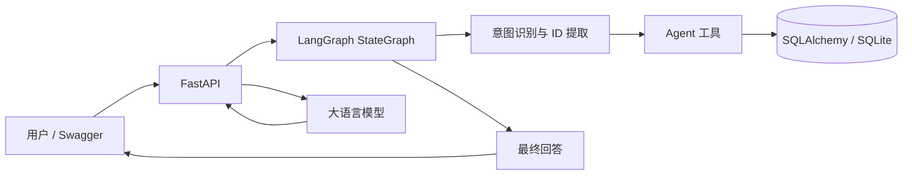
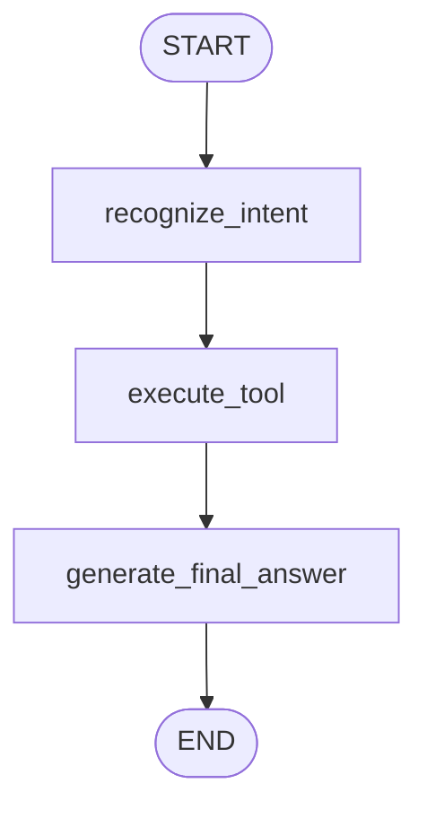

# StudyPilot

[](https://github.com/xinqibo/StudyPilot/actions/workflows/tests.yml)

基于 FastAPI、LangGraph 和大语言模型的智能学习计划 Agent。StudyPilot 可以根据用户目标生成结构化学习计划，并通过自然语言查询计划、查看未完成任务和更新任务状态。

## 项目概览

| 项目能力 | 当前状态 |
| --- | --- |
| FastAPI REST API | 已完成 |
| LangGraph Agent 工具调用 | 已完成 |
| SQLAlchemy + SQLite 持久化 | 已完成 |
| Pytest 自动化测试 | 23 项通过 |
| Agent 场景评测 | 10 项通过 |
| Docker Compose 部署 | 已完成 |
| GitHub Actions | Pytest 与 Docker Build 通过 |

## 核心亮点

- 使用大语言模型生成符合 Pydantic Schema 的结构化学习计划
- 使用 LangGraph `StateGraph` 编排意图识别、工具执行和回答生成
- 支持从中文自然语言中提取 `plan_id` 和 `task_id`
- 提供查询计划、查询未完成任务和标记任务完成等 Agent 工具
- 使用 SQLAlchemy 和 SQLite 持久化计划与任务状态
- 提供统一异常响应、请求耗时日志和 `request_id` 追踪
- 使用 Pytest 覆盖 API、Agent、异常分支和数据库操作
- 建立独立 Agent 评测集，覆盖正常请求、缺少 ID、资源不存在和模糊表达
- 支持 Docker Compose 一键部署、健康检查和 SQLite 数据卷持久化
- 使用 GitHub Actions 自动运行测试并验证 Docker 镜像构建

## 系统架构



## Agent 工作流



当前 LangGraph 由三个串行节点组成，具体工具分派在 `execute_tool` 节点内部完成。

## 支持的 Agent 意图

| 意图 | 示例 | 所需参数 |
| --- | --- | --- |
| `get_plan` | `查看计划1的完整内容` | `plan_id` |
| `get_pending_tasks` | `查看计划1中未完成的任务` | `plan_id` |
| `complete_task` | `把计划1中的任务2标记为完成` | `plan_id`、`task_id` |
| `unknown` | `今天天气怎么样` | 无 |

## Docker 快速启动（推荐）

### 1. 获取项目并进入应用目录

```powershell
git clone https://github.com/xinqibo/StudyPilot.git
cd StudyPilot\study-pilot
```

### 2. 配置环境变量

```powershell
Copy-Item .env.example .env
```

编辑 `.env`：

```dotenv
LLM_API_KEY=your_api_key_here
LLM_MODEL=your_model_name
LLM_BASE_URL=https://example.com/v1
```

使用 OpenAI 官方接口时，可以删除或留空 `LLM_BASE_URL`。不要把包含真实密钥的 `.env` 提交到 Git。

### 3. 构建并启动

确保 Docker Desktop 已启动，然后执行：

```powershell
docker compose up --build -d
docker compose ps
```

打开 Swagger UI：

```powershell
Start-Process "http://127.0.0.1:8000/docs"
```

查看日志：

```powershell
docker compose logs -f api
```

停止容器但保留 SQLite 数据：

```powershell
docker compose down
```

> `docker compose down -v` 会同时删除 SQLite 数据卷，请谨慎使用。

## API 示例

### 创建学习计划

```http
POST /plans
Content-Type: application/json

{
  "goal": "学习 LangGraph 并完成一个学习规划 Agent",
  "current_level": "了解 Python、FastAPI 和基础 SQL",
  "duration_weeks": 4,
  "minutes_per_day": 90
}
```

### 查询计划

```http
GET /plans/1
```

### 标记任务完成

```http
PATCH /plans/1/tasks/1
Content-Type: application/json

{
  "completed": true
}
```

### 与 Agent 对话

```http
POST /agent/chat
Content-Type: application/json

{
  "message": "把计划1中的任务1标记为完成"
}
```

文本没有 ID 时，也可以显式传入参数：

```json
{
  "message": "把这个任务标记为完成",
  "plan_id": 1,
  "task_id": 1
}
```

## 自动化测试与评测

进入应用目录后运行自动化测试：

```powershell
cd study-pilot
python -m pytest -v
```

当前 23 项测试覆盖：

- 学习计划创建、列表和详情查询
- 任务完成和资源不存在
- 请求参数校验和 LLM 失败回退
- Agent 意图识别与 ID 提取
- Agent 工具调用及对话 API

运行 Agent 评测：

```powershell
python -m evals.run_agent_evals
```

评测数据位于 `study-pilot/evals/agent_cases.json`，10 个场景覆盖：

- 正常请求
- 缺少计划 ID 或任务 ID
- 计划或任务不存在
- 无关问题和模糊表达

每次推送到 `master` 或创建 Pull Request 时，GitHub Actions 会自动运行 Pytest 并验证 Docker 镜像构建。

## 统一异常与日志

资源不存在时返回统一结构：

```json
{
  "error": {
    "code": "HTTP_404",
    "message": "Plan not found"
  }
}
```

每个请求的日志包含请求方法、路径、状态码、耗时和 `request_id`，便于定位问题。

## 技术栈

- Python 3.13
- FastAPI、Uvicorn
- Pydantic
- LangGraph
- SQLAlchemy、SQLite
- OpenAI 兼容 SDK（可接入 DeepSeek 等兼容服务）
- Pytest、HTTPX
- Docker、Docker Compose
- GitHub Actions

## 本地启动

```powershell
cd study-pilot
python -m venv .venv
.\.venv\Scripts\Activate.ps1
python -m pip install -r requirements.txt
Copy-Item .env.example .env
python -m uvicorn app.main:app --host 127.0.0.1 --port 8000
```

服务地址：

- API：<http://127.0.0.1:8000>
- Swagger UI：<http://127.0.0.1:8000/docs>
- OpenAPI：<http://127.0.0.1:8000/openapi.json>

## 目录结构

```text
StudyPilot/
├── .github/
│   └── workflows/
│       └── tests.yml             # CI：Pytest 与 Docker Build
├── study-pilot/
│   ├── app/
│   │   ├── main.py               # FastAPI 应用与路由
│   │   ├── schemas.py            # Pydantic 请求、响应模型
│   │   ├── database.py           # 数据库连接与会话
│   │   ├── db_models.py          # SQLAlchemy ORM 模型
│   │   ├── llm.py                # 大语言模型调用
│   │   ├── agent.py              # Agent 状态与核心节点逻辑
│   │   ├── agent_graph.py        # LangGraph StateGraph
│   │   ├── agent_tools.py        # Agent 数据库工具
│   │   └── logging_config.py     # 日志配置
│   ├── evals/                    # Agent 评测集与运行器
│   ├── tests/                    # Pytest 自动化测试
│   ├── .env.example
│   ├── Dockerfile
│   ├── compose.yaml
│   └── requirements.txt
└── README.md
```

## 后续规划

- 使用 LLM 结构化输出增强复杂意图识别
- 增加 LangGraph Checkpointer，实现多轮对话记忆
- 将 SQLite 替换为 PostgreSQL
- 增加用户认证、限流和更完整的可观测性

## License

本项目用于学习、作品展示和技术实践。
